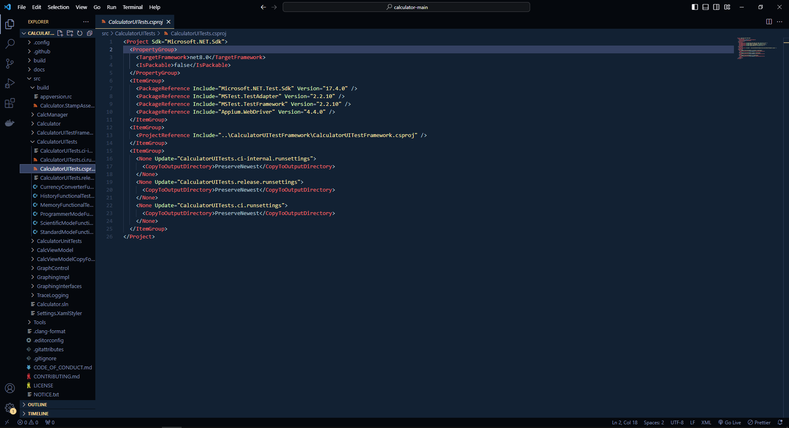
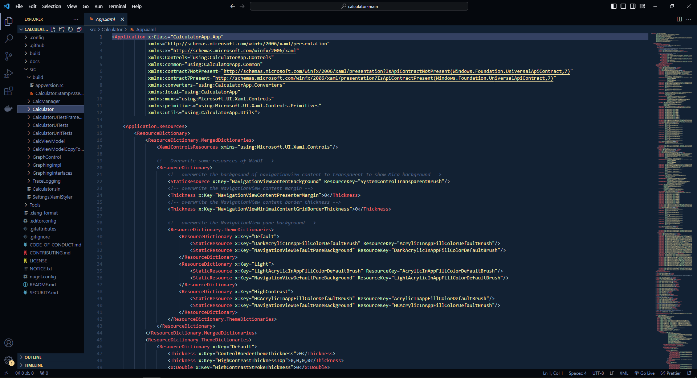

# Infinitus Dark Theme

## VS Code Extension :-> [Infinitus](https://marketplace.visualstudio.com/items?itemName=jayavelrajan.infinitus-dark)

"Infinitus" is the dark theme extension for VS Code, I created with love, and could not wait for you to try it.

Consider giving me feedback after you have used it.

Thanks for being part of this journey! 🙌

## Color Palette

#B9CDDA - Tranquil Sky Blue  
#F4F4F9 - Whispering Snow 
#F5D491 - Sunlit Sand 
#FF6868 - Radiant Rouge 
#FFEAA7 - Golden Glow 
#DCFFB7 - Meadow Mist 
#FFC47E - Apricot Delight 
#86A7FC - Serene Sky Blue 
#FF8080 - Coral Crush 
